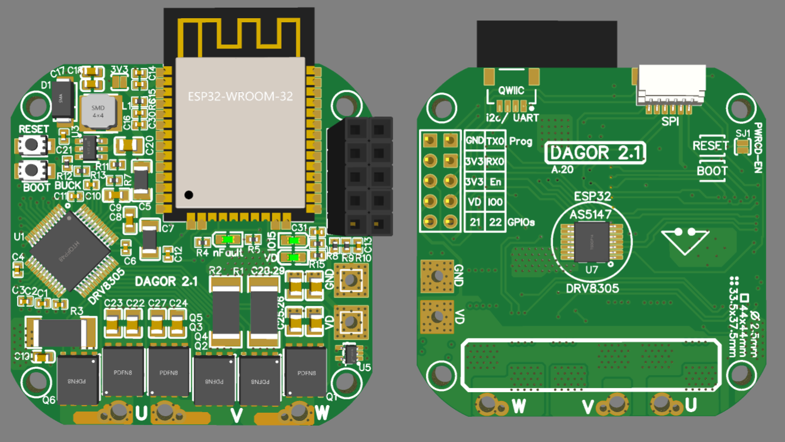

# Dagor-Brushless-Controller
ESP32 based brushless motor controller for robotics applications. The Dagor Brushless controller has an on-board magnetic encoder, a three-phase MOSFET driver, three MOSFET half-bridges, a temperature sensor and current sensing resistors. 

## Key specs
| Specification    | Rating          |
| ------------- |:-------------:|
| Dimensions      | 44 x 4mm |
| Power source voltage      | 5-24V |
| Peak current   | up to 40A |
| Magnetic sensor resolution | 14 bits |
| Temperature sensor range | -10 ~ 120°C |

## Set-up

### The three-phase gate driver
The DRV8305 is a three-phase gate driver that can drive high and low-side N-channel MOSFETS. What makes this driver special is the bunch of programable functions and the protection included.
With the Janus Controller you can use the DRV8305 in its three operation modes: 6-PWM input, 3-PWM input or 1-PWM input. The [example code](JC01F05/JC01F05.ino) works with the driver set through SPI to operate in the 3-PWM mode.
One feature I like is its fault diagnostics, if the nFault pin pulses it means there is a *warning* that can be read through SPI. If the pin is pulled low it means the driver detected a *fault*, which can also be read through SPI, and the output MOSFETs will be placed in their high impedance state.
The Janus Controller board has a red indicator LED that will turn on if a *warning* or a *fault* is detected.
A few of the faults that the driver reports are the following: high temperature flags, source under or over-voltage, VDS over current monitors, gate drive fault, etc.
The picture bellow shows the simplified schematic of the driver that can be found in the [DRV8305 datasheet](https://www.ti.com/lit/ds/symlink/drv8305.pdf?ts=1593641896221&ref_url=https%253A%252F%252Fwww.google.com%252F). Please refer to it if you want to learn more about all the features of this driver IC.

## The example code
The example code was done in the Arduino IDE, running the [SimpleFOC](https://simplefoc.com) Arduino Library. By changing a simple parameter, this code allows you to control position and velocity of your burshless motor, or setting a voltage as you would do with a DC motor. 
Make sure you follow the following steps to make sure the code will compile.

### 1. ESP32 set-up
*Random nerd tutorials* have a really easy to follow guide on how to set-up the ESP32 on the Arduino IDE. Follow the steps on [this link](https://randomnerdtutorials.com/installing-the-esp32-board-in-arduino-ide-windows-instructions/) and make sure you can compile one of the examples shown.

### 2. Running the encoder example
Download the [Encoder Tester](JC01F05/JC01F05.ino) and open it on your Arduino IDE. Upload it to the ESP32 and open the Serial terminal and make sure the measurement is accurate. Move the motor's rotor one whole whole rotation and make sure the trerminal prints 360 degrees. 

### 3. Simple FOC library installation
The [SimpleFOC](https://github.com/simplefoc) repository has an extremely detailed explanation on how to install the library. The easiest way is to install it through the library manager as shown in the picture.  

### 4. Running the position control example
Download the [position control example code](D021F010/D021F010.ino) and open it on your Arduino IDE; there are a few parameters that you might have to tweak. I really recommend reading the [SimpleFOC](https://docs.simplefoc.com/) documentation. 

## Contact
I'm happy to hear from your projects and to help in any way possible!  
davidglzrys@gmail.com  
[Linkedin](https://www.linkedin.com/in/david-g-reyes/)  
[YouTube](https://www.youtube.com/channel/UC4gsPZan2T4v5LpJ5J_t7sQ/featured)
