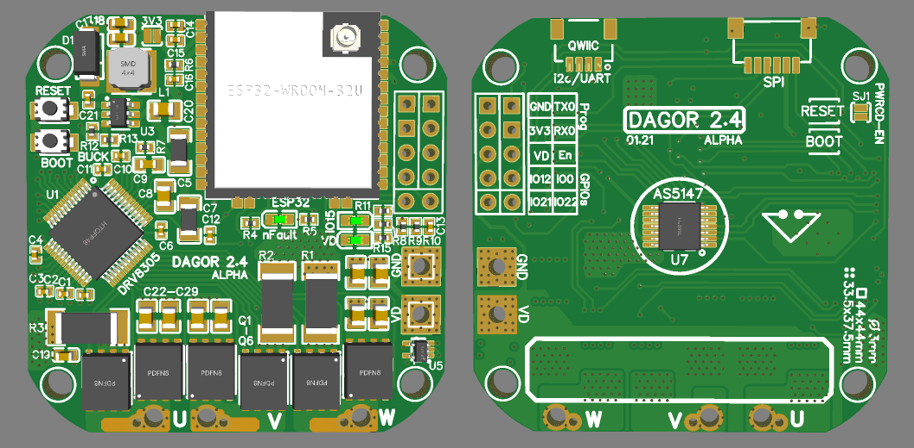
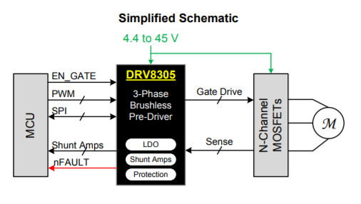
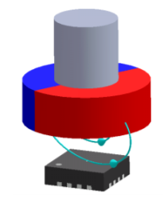
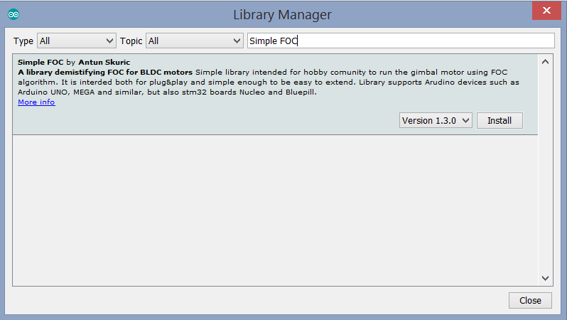

# Dagor Brushless Controller
The Dagor controller is an ESP32 based brushless controller that has an on-board magnetic encoder, a three-phase MOSFET driver, three MOSFET half-bridges, a temperature sensor and current sensing resistors.

There will be an alpha run of the board soon, if you're interested please fill this forms: https://forms.gle/S7gtZfyXZeQ7XbT29



## Key specs
| Specification    | Rating          |
| ------------- |:-------------:|
| Dimensions      | 44 x 44mm |
| Mass    | 12g |
| Power source voltage      | 5-24V |
| Peak current   | up to 40A |
| Magnetic sensor resolution | 14 bits |
| Temperature sensor range | -10 ~ 120°C |

## 1. The board

### 1.1 The microcontroller
The Dagor board uses a 160 MHz, 32 bit, dual-core ESP32 microcontroller. The ESP32 has wireless capabilities, such as WIFI and Bluetooth, but most importantly ESP-NOW. ESP-NOW is a communication protocol by *Espressif* that enables multiple devices to talk wirelessly to each other via short packet transmission. See section 2.2 to see how to setup your Arduino IDE to be able to flash the ESP32.
Due to popular demand of the alpha testers the Dagor Controller Alpha 2.4 will come with the ESP32-WROOM-32U. This makes the board have a smaller footprint and has a u.fl connector to attach an external antenna.

### 1.2 The three-phase gate driver
The DRV8305 is a three-phase gate driver that can drive high and low-side N-channel MOSFETS. What makes this driver special is the amount of programmable parameters, the protection features and the fault diagnostics; all of which take place through an SPI bus.
The [firmware](Firmware/D021F022/D021F022.ino) works with the driver, set through SPI, to operate in the 3-PWM mode.
The driver has two types of faults: *warning* and *fault*. If either occur the red indicator LED on the Dagor board will turn on; if a *fault* occurs the the output MOSFETs will be placed in their high impedance state, if a *warning* occurs operation will continue normally.
A few of the faults that the driver reports are the following: high temperature flags, source under or over-voltage, VDS over current monitors, gate drive fault, etc.
The picture below shows the simplified schematic of the driver that can be found in the [DRV8305 datasheet](https://www.ti.com/lit/ds/symlink/drv8305.pdf?ts=1593641896221&ref_url=https%253A%252F%252Fwww.google.com%252F). Please refer to it if you want to learn more about all the features of this driver IC.



### 1.3 The magnetic sensor
The Dagor Controller has a high resolution absolute magnetic sensor for its precise control. The sensor makes use of a diametrically polarized magnet attached to the motor's rotor, as shown in the picture. To learn more about this sensor refer to the [AS5147 datasheet](https://ams.com/documents/20143/36005/AS5147_DS000307_2-00.pdf).



### 1.4 The buck converter
The Dagor Controller has a buck converter that regulates the input voltage to 3.3V to power the ESP32 and the magnetic sensor and to be able to power external peripherals, such as: an external magnetic sensor, encoder, display, etc.

### 1.5 The temperature sensor
The Maximum continuous current of the Dagor Controller depends on the quality of heat-sinking and cooling. A small heat-sink or a cooling fan can have great impacts on the maximum continuous current the board can handle. The on-board temperature sensor is a great way to assure the user stays within the safe range of operating temperature. The temperature sensor is found near the MOSFETs to obtain a more accurate measurement of the temperature of the controller's power stage. To learn more about this sensor please refer to the [STLM20W87F datasheet](https://datasheet.lcsc.com/szlcsc/1810010411_STMicroelectronics-STLM20W87F_C129796.pdf).

## 2. Getting started
The firmware was done in the Arduino IDE, running the [SimpleFOC](https://simplefoc.com) Arduino Library. By changing a few simple parameter, this code allows you to drive a brushless motor in three control modes: position, velocity and voltage. Make sure you follow the next steps to make sure the code will compile.

### 2.1 Arduino IDE/ ESP32 set-up
The ESP32 is supported using [arduino-esp32 package](https://github.com/espressif/arduino-esp32); open source software provided by the espressif. You can download the support package through the Arduino Board Manager by searching for ESP32 or follow the instructions on the [package installation webpage](https://github.com/espressif/arduino-esp32#installation-instructions). Once the package is installed make sure you can compile one of the examples.

### 2.2 Flashing the Dagor Controller
It is required a USB to TTL adapter to flash the Dagor board; I recommend using the CP2102 module. Once the adapter is connected to the board, to put the Dagor board in flash mode press and hold the Reset Button, press once the Boot Button and then release the Reset Button. You should be able to read on the Serial monitor that the board is *waiting for download*. Press the upload button on the Arduino IDE and the ESP32 will begin flashing, after it's done press the Reset Button once and the code should start running.

### 2.3 Running the encoder example
Download the [Encoder Tester](JC01F05/JC01F05.ino) and open it on your Arduino IDE. Upload it to the ESP32 and open the Serial terminal and make sure the measurement is accurate. Move the motor's rotor one complete rotation and make sure the terminal prints 360 degrees.

### 2.4 SimpleFOC library installation
The [SimpleFOC](https://github.com/simplefoc) repository has an extremely detailed explanation on how to install the library. The easiest way is to install it through the library manager as shown in the picture.



Once installed there's a file that should be replace in order to avoid [this](https://github.com/espressif/arduino-esp32/issues/3743) bug with the ESP32's MCPWM unit (necessary for smooth motor control). In order to resolve this bug you need to replace one header file in the arduino-esp32 package, called [mcpwm.h](Dependencies/mcpwm.h).
This file is usually found in (Windows):

>C:\Users\(you user name)\AppData\Local\Arduino15\packages\esp32\hardware\esp32\1.0.4\tools\sdk\include\driver\driver

Navigate to this directory and replace the file with [this](Dependencies/mcpwm.h).

### 2.4 The firmware
Download the [firmware](Firmware/D021F022/D021F022.ino) and open it on your Arduino IDE; there are a few parameters that you will have to tweak for your set-up, the main ones are:
```c++
//#######_USER VARIABLES_#######
byte pp = 7;                  //BLDC motor number of pole pairs
float phaseRes = 0.560;       //Phase winding resistance [ohms]
byte sourceVoltage = 12;      //Voltage of your power source [Volts]
byte maxCurrent = 2;          //Rough approximation of max current [Amps]
```

These are the control loops parameters, to obtain the desired response out of the controller they need to be tuned. The parameters can be tuned via the Serial Monitor sending a special character next to the desired value. For example, to change the Position control loop PROPORTIONAL gain from 25 to 10 the user writes in the Serial Monitor *K10*; to change the Velocity control loop INTEGRAL gain from 2.5 to 3 the user writes *I3*. To the right on the snip of code bellow there are the special characters that tune each corresponding parameter. Make sure to write the final values of the parameters to update the firmware and upload it again.
```c++
//#######_CONTROLLER PARAMETERS_#######
float ki = 0.002;             //Velocity control loop PROPORTIONAL gain value   - P_
float ti = 2.5;               //Velocity control loop INTEGRAL gain value       - I_
float lpFilter = 0.000;       //Velocity measurement filter                     - F_
float kp = 10;                //Position control loop PROPORTIONAL gain value   - K_
float voltageRamp = 25;       //Change in voltage allowed [Volts per sec]       - R_
float voltageLimit = phaseRes*maxCurrent;   //Voltage limit                     - L_
float velocityLimit = 2000;   //Velocity limit [rpm]                            - V_
```

To dig deeper into the role of these parameters please refer to the [SimpleFOC](https://docs.simplefoc.com/motion_control) documentation.

## 3.0 Firmware Roadmap
- [ ] Torque/ current control mode
- [ ] PWM input control
- [ ] Full fault diagnostics report
- [ ] DRV8305 communication library
- [ ] Deep-sleep mode
- [ ] Save parameters in ESP32's EEPROM

## Contact
davidglzrys@gmail.com  
[Linkedin](https://www.linkedin.com/in/david-g-reyes/)  
[YouTube](https://www.youtube.com/channel/UC4gsPZan2T4v5LpJ5J_t7sQ/featured)
