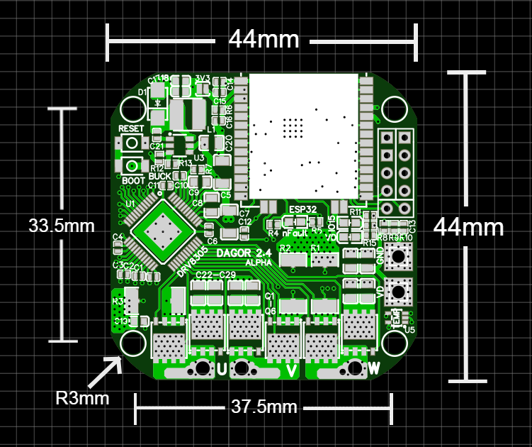
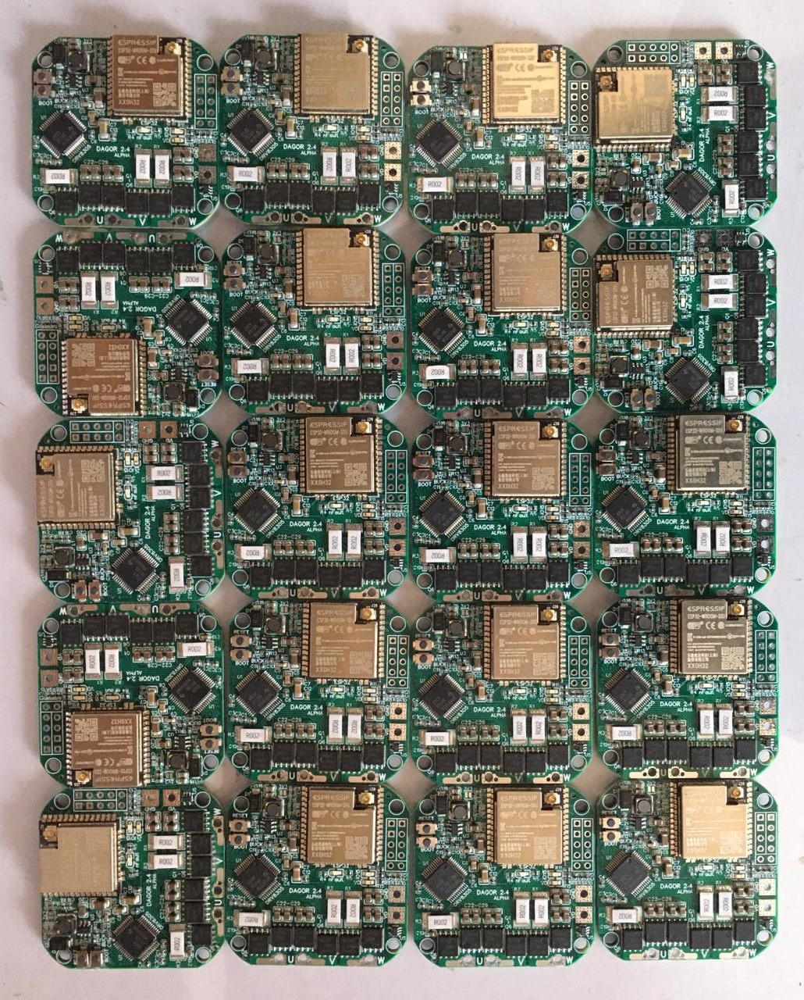

# Dagor Brushless Controller

The Dagor Controller is a fully integrated tiny solution for brushless-based actuators with wireless capabilities and three operation modes: angular position, velocity and torque. It is an ESP32-based brushless controller that has an on-board magnetic encoder, a three-phase MOSFET driver, three MOSFET half-bridges, a temperature sensor and current sensing resistors.

> 📢 DOCUMENATION WEBSITE: https://docs.dagor.dev/

## Key specs
| Specification    | Rating          |
| ------------- |:-------------:|
| Dimensions      | 44 x 44mm |
| Mass    | 12g |
| Power source voltage      | 5-24V |
| Peak current   | up to 40A |
| Magnetic sensor resolution | 14 bits |
| Temperature sensor range | -10 ~ 120°C |

> Note: The project is currently on it’s Alpha stage and with the help of the Alpha testers the project will move forward faster.

## What makes this Controller different?
The *Dagor Brushless Controller* was designed as a simple platform for hobbyist and students to power brushless-based projects. This board offers wired and wireless connectivity modes to accommodate a variety of different kinds of projects. The firmware for this board was developed for the Arduino development environment and powered by the [SimpleFOC project](simplefoc.com). This code is merely a starting point as it’s encouraged to modify it to fit specific projects. The firmware being very easy to modify and understand gives some key advantages:

- great platform for single board projects
- custom communication schemes for multi-board projects
- implementation of unique control laws
- endless amount of compatible libraries

## Dimensions

## Firmware Roadmap
- [ ] Torque/ current control mode
- [ ] PWM input control
- [ ] Full fault diagnostics report
- [ ] DRV8305 communication library
- [ ] Deep-sleep mode
- [ ] Save parameters in ESP32's EEPROM

## Contact
david@simplefoc.com 
[Linkedin](https://www.linkedin.com/in/david-g-reyes/)  
[YouTube](https://www.youtube.com/channel/UC4gsPZan2T4v5LpJ5J_t7sQ/featured)

