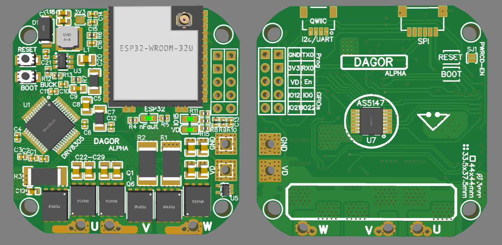

# Dagor Brushless Controller

The Dagor controller is an ESP32 based brushless controller that has an on-board magnetic encoder, a three-phase MOSFET driver, three MOSFET half-bridges, a temperature sensor and current sensing resistors.

